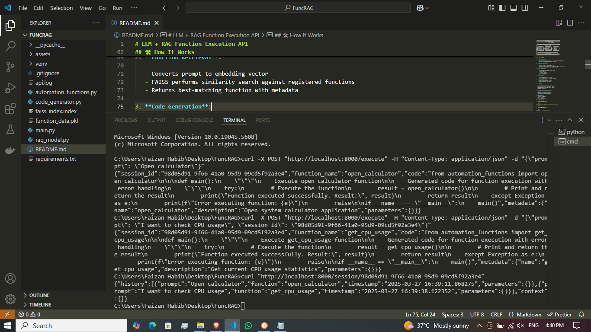
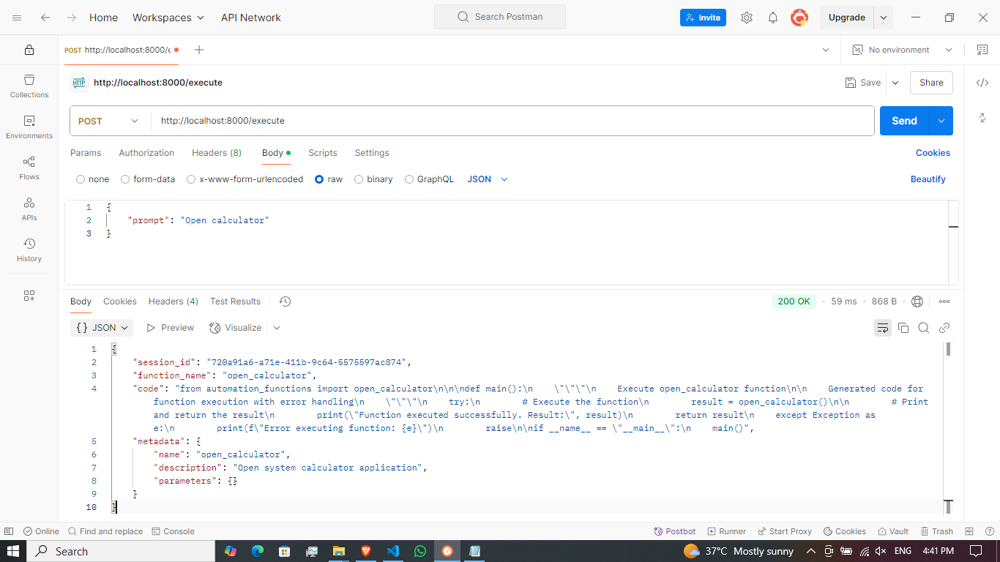
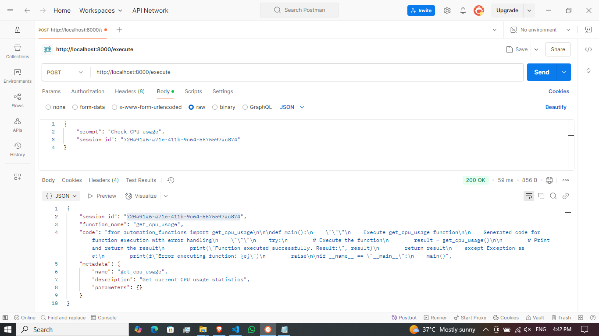
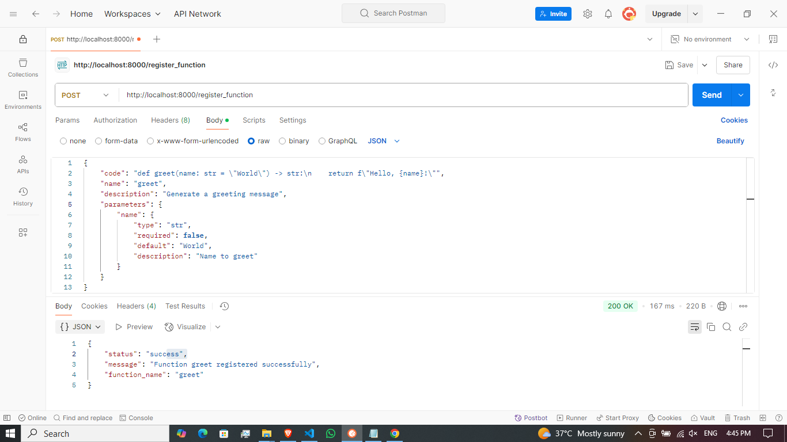
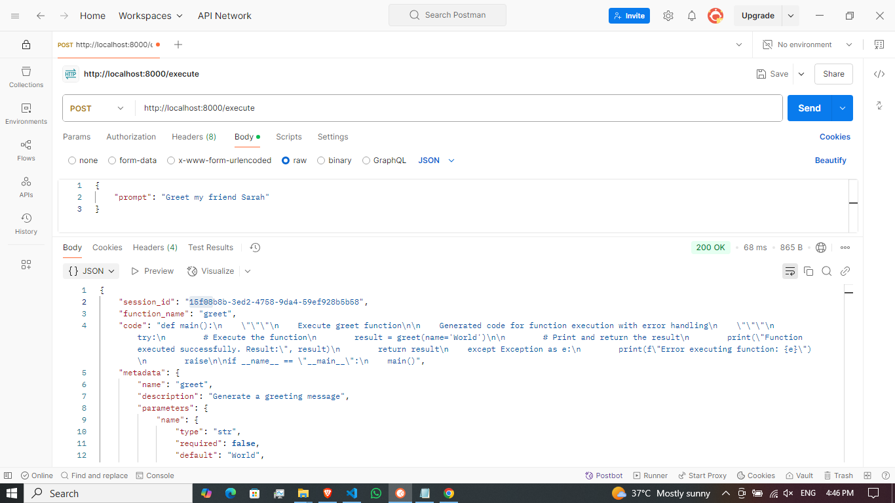
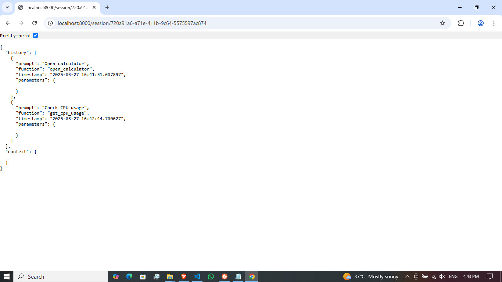

# LLM + RAG Function Execution API


## Project Description

The LLM + RAG Function Execution API is an innovative Python-based service that bridges natural language commands with executable automation functions. This system combines Retrieval-Augmented Generation (RAG) techniques with traditional programming to create an intelligent function dispatching service that understands user intent and generates appropriate executable code.

## Core Concept

At its heart, this project transforms natural language requests like "Open Chrome browser" or "Check CPU usage" into dynamically generated Python code that executes the corresponding actions. The system leverages vector similarity search to match user prompts with the most relevant pre-registered functions from its automation library.

  
_End-to-end system workflow demonstration_

## 📌 Table of Contents

- [Approach](#-approach)
- [Solution Architecture](#-solution-architecture)
- [How It Works](#-how-it-works)
- [Features](#-features)
- [Installation](#-installation)
- [Quick Start](#-quick-start)
- [API Endpoints](#-api-endpoints)
- [Usage Examples](#-usage-examples)
- [Extensibility](#-extensibility)
- [License](#-license)

## 🚀 Approach

This project combines several modern AI/ML techniques:

1. **Retrieval-Augmented Generation (RAG)**: Uses vector similarity search to find the most relevant functions for a given natural language prompt
2. **Function-as-a-Service**: Treats individual automation functions as executable units
3. **Dynamic Code Generation**: Creates executable Python code on-the-fly based on user requests
4. **Session Context**: Maintains conversation history for context-aware execution

## 🏗 Solution Architecture

```plaintext
┌─────────────────────────────────────────────────────┐
│                   Client Application                │
└─────────────────────────┬───────────────────────────┘
                          │ HTTP Requests
                          ▼
┌─────────────────────────────────────────────────────┐
│                   FastAPI Server                    │
│ ┌─────────────┐   ┌─────────────┐   ┌─────────────┐ │
│ │ Function    │   │ RAG-Based   │   │ Code        │ │
│ │ Registry    │   │ Retriever   │   │ Generator   │ │
│ │ (Built-in + │◄─►│ (FAISS      │◄─►│ (Dynamic    │ │
│ │  Custom)    │   │  Vector DB) │   │  Imports +  │ │
│ └─────────────┘   └─────────────┘   └─────────────┘ │
│                                                     │
│ ┌───────────────────────────────────────────────┐   │
│ │                Session Manager                │   │
│ └───────────────────────────────────────────────┘   │
└─────────────────────────────────────────────────────┘
```

## 🛠 How It Works

1. **User Submission**:

   - Sends natural language prompt (e.g., "Open Chrome browser")
   - Optional parameters and session context

2. **Function Retrieval**:

   - Converts prompt to embedding vector
   - FAISS performs similarity search against registered functions
   - Returns best-matching function with metadata

3. **Code Generation**:

   - Creates executable Python script with:
     - Proper imports
     - Parameter handling
     - Error handling
     - Result processing

4. **Execution**:

   - Returns generated code to client
   - Client executes code or uses API response

5. **Session Management**:
   - Maintains conversation history
   - Enables contextual follow-ups

  
_Example: Executing a built-in system monitoring function_

## ✨ Features

- **Predefined Automation Functions**:

  - Application control (browsers, editors)
  - System monitoring (CPU, memory, disk)
  - Command execution

- **Custom Function Registration**:

  - Add new functions at runtime
  - Automatic parameter detection
  - Integrated into search system

- **Robust API**:
  - Session management
  - Error handling
  - Detailed metadata

## 💻 Installation

1. Clone the repository:

```bash
git clone https://github.com/faizan9cm/funcrag.git
cd funcrag
```

2. Install dependencies:

```bash
pip install -r requirements.txt
```

3. Start the API server:

```bash
python main.py
```

## 🏎 Quick Start

1. Start the server:

   ```bash
   python main.py

   ```

2. curl -X POST "http://localhost:8000/execute" \
   -H "Content-Type: application/json" \
   -d '{"prompt": "Check CPU usage"}'

  
_Follow-up command in the same session_

## 🌐 API Endpoints

| Endpoint                | Method | Description                                       |
| ----------------------- | ------ | ------------------------------------------------- |
| `/execute`              | POST   | Execute function based on natural language prompt |
| `/register_function`    | POST   | Register new custom function                      |
| `/session/{session_id}` | GET    | Get session history                               |

## 🚀 Usage Examples

### 1. Execute a built-in Function

```bash
curl -X POST "http://localhost:8000/execute" \
-H "Content-Type: application/json" \
-d '{"prompt": "Open calculator"}'
```

### 2. Register a Custom Function

```bash
curl -X POST "http://localhost:8000/register_function" \
-H "Content-Type: application/json" \
-d '{
    "code": "def greet(name: str = \"World\") -> str:\n    return f\"Hello, {name}!\"",
    "name": "greet",
    "description": "Generate a greeting message",
    "parameters": {
        "name": {
            "type": "str",
            "required": false,
            "default": "World",
            "description": "Name to greet"
        }
    }
}'
```

  
_Registering a new greeting function via API_

### 2. Execute a custom Function

```bash
curl -X POST "http://localhost:8000/execute" \
-H "Content-Type: application/json" \
-d '{"prompt": "Greet my friend Sarah"}'
```

  
_Executing the newly registered custom function_

### 3. View Session History

```bash
curl "http://localhost:8000/session/YOUR_SESSION_ID"
```

  
_Viewing complete interaction history for a session_

## 🔧 Extensibility

### Adding Built-in Functions

1. Add new functions to `automation_functions.py`
2. Register them in the `FUNCTION_REGISTRY` dictionary
3. The system will automatically:
   - Index them for search
   - Make them available for execution

### Key Technical Decisions

1. **FAISS over ChromaDB**: Chosen for performance and simplicity
2. **Dynamic Code Generation**: Enables flexible execution environments
3. **Session Context**: Improves multi-turn interactions

This project demonstrates a practical implementation of RAG for function retrieval and execution, showcasing several important concepts in modern AI/ML systems.

## 📜 License

Distributed under the MIT License. See `LICENSE` for more information.
